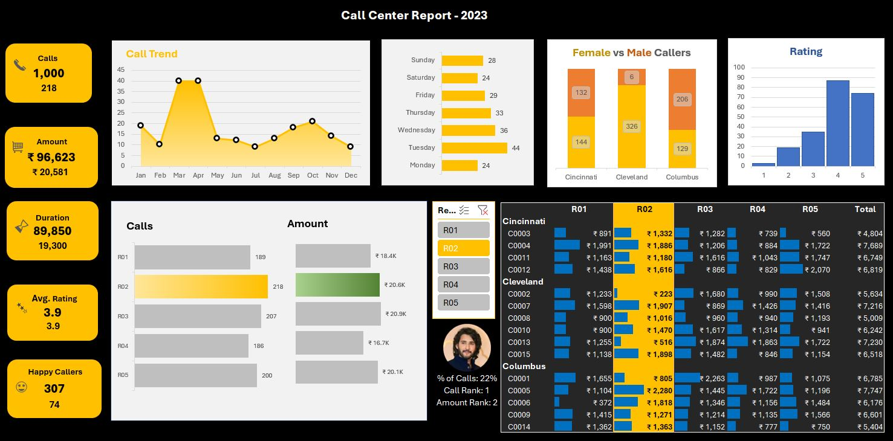
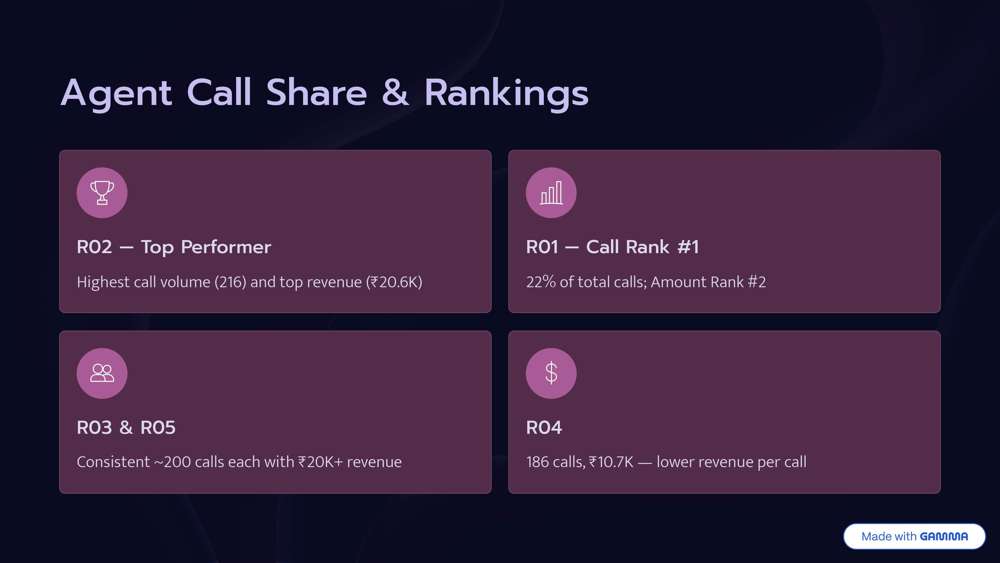

# 📊 Call Center Performance Dashboard

This project is an end-to-end Excel Dashboard case study focused on analyzing Call Center performance using Excel, Pivot Tables, Pivot Charts, and advanced formulas. The dashboard provides business insights into call volume, revenue, customer satisfaction, call duration, regional performance, and representative-level analysis.

The main objective of this project is to monitor operational efficiency, customer experience, and performance trends across regions and representatives to support better business decision-making.

---

## 🛠 Tools & Technologies Used

- Microsoft Excel
- Pivot Tables
- Pivot Charts
- Advanced Excel Formulas
- KPI Dashboard Design
- Data Cleaning & Transformation
- Gamma AI (Business Report Presentation and Project Documentation)

---

## 🔄 Project Workflow

### 1. Data Preparation using Excel

- Data cleaning and formatting
- Creating Financial Year column
- Weekday extraction from call date
- Duration standardization
- Average Rating calculations
- Happy Caller identification
- Age grouping and segmentation

---

### 2. Pivot Table Analysis

Built multiple Pivot Tables to analyze:

- Total Calls
- Revenue / Amount Analysis
- Duration Analysis
- Average Rating Distribution
- Female vs Male Caller Comparison
- Region-wise Performance
- Representative-wise Performance
- Customer Satisfaction Trends
- Monthly Call Trends
- Weekday Call Distribution

---

### 3. Interactive Excel Dashboard

Created a fully interactive dashboard inside Excel using:

- KPI Cards
- Monthly Trend Charts
- Rating Distribution Charts
- Gender Comparison by City
- Region-wise Performance Analysis
- Rep-wise Performance Matrix
- Slicers for dynamic filtering

---

## 📈 Key Business Insights

- Identified highest-performing region (**R02**)
- Analyzed customer satisfaction through rating distribution
- Compared male vs female caller behavior across cities
- Measured revenue contribution by representatives
- Evaluated operational peaks by weekday and monthly trends
- Tracked Happy Caller performance metrics

---

## 🎯 Project Outcome

This project demonstrates how Excel can be used to build a complete business intelligence dashboard without external BI tools. It reflects real-world reporting workflows where Pivot Tables, formulas, and dashboards help businesses monitor operations and improve performance.

---

## 📸 Dashboard Preview

---

## 📄 Project Report Preview

### Top Agent Call Share & Ranking

A detailed business report and presentation was created using Gamma AI to provide deeper business insights and professional project documentation.

👉 [View Full Project Report](https://drive.google.com/file/d/1luCTqrg5bAo06PCz2NnpvVA4r-G3c66Q/view)

---

## 👨‍💻 Author

Udaydeep  
Data Analytics | Excel | SQL | Python | Power BI
